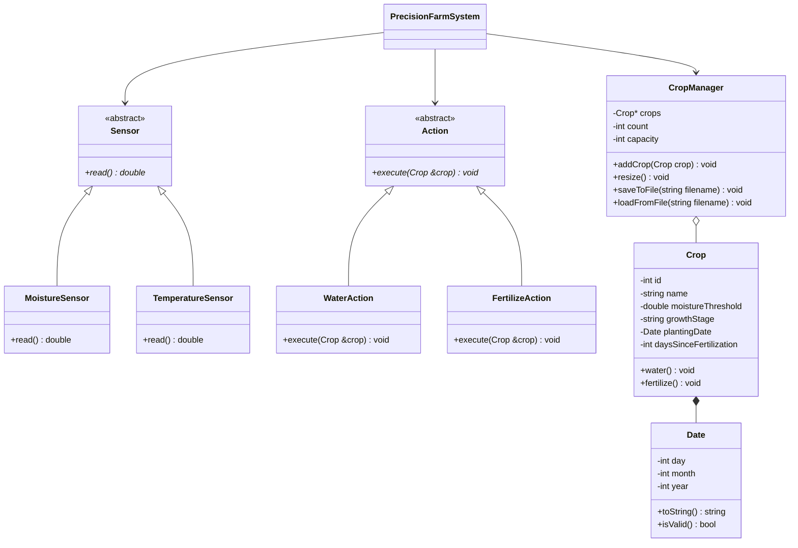
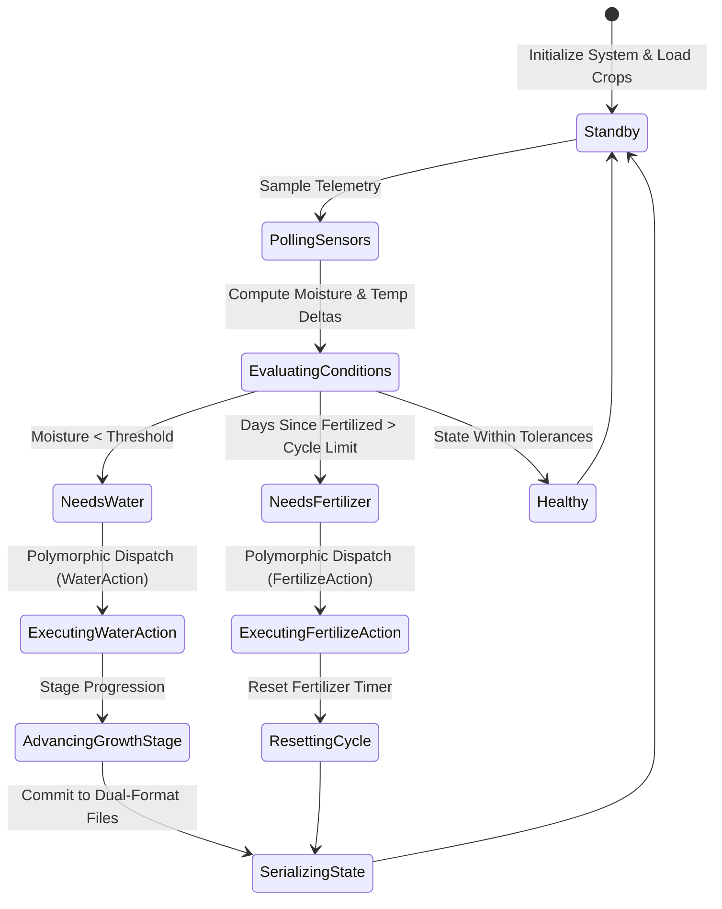

<div align="center">

# PakAgri — Automated Crop Irrigation System

An object-oriented agricultural automation simulation built in C++ featuring polymorphic sensor telemetry, rule-based irrigation logic, dynamic memory allocation, and dual-format binary state persistence.

[](https://en.cppreference.com/)
[](https://nu.edu.pk/)
[](#object-oriented-architecture)
[](#dual-format-persistence)

</div>

---

### Navigation

[Overview](#project-overview) · [OOP Architecture](#object-oriented-architecture) · [Class Hierarchy](#class-hierarchy--responsibilities) · [Core Features](#core-features) · [Data Persistence](#dual-format-persistence) · [Project Structure](#project-structure) · [Memory & Internals](#dynamic-memory-management--system-internals) · [Decision Engine](#environmental-telemetry--decision-engine-lifecycle) · [Author](#author)

---

## Project Overview

Smart agricultural systems depend on continuous sensor telemetry, soil moisture monitoring, and automated actuation to optimize crop yields and prevent resource wastage. In desktop simulation environments, managing complex agricultural models requires clean domain abstractions, robust state encapsulation, and safe dynamic resource lifecycles.

**PakAgri** (Precision Crop Automation System) is a modular **C++** application designed to simulate an intelligent smart-farming lifecycle. The system models crops, simulated physical sensors (moisture and temperature), and corrective agricultural interventions (watering and fertilization) using strict **Object-Oriented Programming (OOP)** principles. 

The software includes a custom dynamic memory manager (handling dynamic array reallocation from scratch), dual-format binary and plain-text file persistence, ANSI terminal formatting, and automated decision-making that evaluates real-time sensor streams against crop-specific growth thresholds.

> **Academic Note:** Developed as part of the Object-Oriented Programming (OOP) coursework at FAST-NUCES.

---

## Object-Oriented Architecture

The system is structured around the four primary tenets of object-oriented design:

- **Encapsulation:** Class internals such as crop thresholds, growth milestones, and memory buffers are private. Mutations occur solely through validated setters and member functions enforcing domain invariants.
- **Inheritance:** Extensible base classes (`Sensor`, `Action`) establish clean contracts for sensor sampling and agronomic interventions.
- **Polymorphism:** Pure virtual functions (`virtual double read() = 0;`, `virtual void execute(Crop &crop) = 0;`) enable dynamic runtime dispatch across heterogeneous sensor arrays and automated actions.
- **Abstraction:** The high-level controller `PrecisionFarmSystem` coordinates the lifecycle without coupling itself to specific sensor hardware implementations or file-serialization mechanics.



---

## Class Hierarchy & Responsibilities

### Domain Classes

1. **`Date`**: Encapsulates day, month, and year values with calendar boundary validation, string parsing, and formatted output generation.
2. **`Crop`**: Represents an individual crop variety. Encapsulates unique identifier, name, moisture threshold ($0-100\%$), growth stage (`Seedling`, `Vegetative`, `Flowering`, `Maturity`), planting date, and elapsed days since the last fertilization.
3. **`Sensor` (Abstract Base Class)**: Defines the telemetry interface with a pure virtual `read()` method:
   - **`MoistureSensor`**: Simulates soil moisture percentage readings based on environmental conditions.
   - **`TemperatureSensor`**: Samples ambient temperatures in degrees Celsius.
4. **`Action` (Abstract Base Class)**: Defines the actuation interface with a pure virtual `execute(Crop &crop)` method:
   - **`WaterAction`**: Replenishes crop soil moisture levels and advances the crop through successive growth stages.
   - **`FertilizeAction`**: Records fertilization events and resets the fertilization cycle timer.

### Management & Control

5. **`CropManager`**: Manages the dynamic heap allocation of crops. Implements manual dynamic array allocation (`new[]`), deallocation (`delete[]`), capacity expansion (`resize()`), deep copying, and file I/O operations.
6. **`PrecisionFarmSystem`**: Central controller integrating sensor polling, evaluation against user-configured thresholds, automated action suggestions, and interactive terminal navigation.
7. **`MarginBuf`**: Custom stream buffer derived from `std::streambuf` that automatically applies terminal indentation margins and visual formatting across standard console outputs.

---

## Core Features

- **Polymorphic Sensor Monitoring:** Simulated continuous sampling of environmental soil moisture and ambient temperature using virtual method dispatch.
- **Automated Actuation Recommendations:** Real-time rule engine that checks current soil moisture against crop-specific thresholds, automatically prompting `WaterAction` or `FertilizeAction` when conditions warrant.
- **Crop Growth Progression:** Autonomous growth lifecycle advancement (`Seedling` $
ightarrow$ `Vegetative` $
ightarrow$ `Flowering` $
ightarrow$ `Maturity`) as watering actions are executed over time.
- **Custom Dynamic Memory Allocation:** Heap-allocated crop array with automatic capacity doubling and safe memory reclamation, avoiding memory leaks without relying on STL containers.
- **Dual-Format Data Persistence:** Synchronous binary file serialization ensuring fast, compact state preservation alongside human-readable text exports.
- **Formatted Terminal UI:** Clean terminal layout built with custom stream buffering, margin indentations, loading progress indicators, and ANSI color highlights.

---

## Dual-Format Persistence

The application maintains persistent farm states across multiple executions using two complementary storage strategies:

| File Name | Format | Storage Mechanism | Purpose |
|---|---|---|---|
| **`crops.dat`** | Binary | `std::ios::binary` serialization | High-speed, compact binary dump of crop records and growth stages for cold starts. |
| **`thresholds.dat`** | Binary | `std::ios::binary` serialization | Preserves custom per-crop moisture threshold configurations across sessions. |
| **`crops.txt`** | Plain Text | Structured formatted stream output | Human-readable audit log and plain-text export for manual inspection. |

---

## Project Structure

```text
PakAgri---Automated-Crop-Irrigation-System/
├── OOP_Project.cpp           # Main implementation (all classes, memory manager, and controller)
├── crops.dat                 # Serialized binary database of registered crops
├── thresholds.dat            # Serialized binary storage for crop moisture thresholds
├── crops.txt                 # Formatted plain-text crop backup and status report
├── ProjectProposalOOP.docx   # Academic project proposal and domain specification
└── README.md                 # Project documentation
```

---

## Dynamic Memory Management & System Internals

PakAgri maintains strict memory invariants and low-level resource management without relying on STL dynamic containers:

- **Custom Dynamic Array Resizing:** The `CropManager` allocates internal memory directly on the free store using typed array pointers `Crop* crops`. When the collection exceeds its allocation capacity, `resize()` executes an exponential capacity doubling strategy ($C_{t+1} = 2 \cdot C_t$), allocating a new contiguous buffer, performing element-by-element deep copies with copy constructors, and freeing the superseded memory block via `delete[] crops` to eliminate memory leaks.
- **Terminal Stream Buffer Interception (`MarginBuf`):** Implements an object-oriented stream buffer wrapper deriving from `std::streambuf`. By overriding the virtual `overflow(int ch)` method, the buffer intercepts every character transmitted to `std::cout`, injects uniform left-margin formatting spaces upon newline triggers, and applies ANSI bold blue styling (`\033[1;34m`) without altering client print syntax.
- **Resource Ownership & Rule of Three:** The management layer maintains clear ownership semantics, coordinating constructors, destructors, and dynamic reallocations to safely govern object lifetimes across deep hierarchies.

---

## Environmental Telemetry & Decision Engine Lifecycle

The system coordinates continuous environmental monitoring with deterministic agronomic interventions:



1. **Stochastic Sensor Sampling:** `MoistureSensor` and `TemperatureSensor` generate simulated real-world telemetry streams, modeling soil drying curves and ambient temperature spikes.
2. **Deterministic Evaluation:** The decision engine compares current moisture values $M_{\text{curr}}$ against crop-specific requirement thresholds $M_{\text{target}}$, triggering `WaterAction` when $M_{\text{curr}} < M_{\text{target}}$.
3. **Growth Cycle Advancements:** Execution of watering actions dynamically drives physiological growth progressions (`Seedling` → `Vegetative` → `Flowering` → `Maturity`).
4. **State Commit:** Every agricultural intervention is serialized synchronously to binary storage (`crops.dat`, `thresholds.dat`) and plain-text audit logs (`crops.txt`).

---

## Author

**Muhammad Hasan Dad Khan**  
Computer Science — FAST-NUCES  

*Developed as part of the Object-Oriented Programming (OOP) coursework at FAST-NUCES.*\n